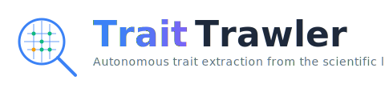
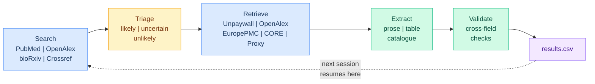

<p align="center">
  
</p>

<p align="center">
  <strong>An autonomous AI agent that builds trait databases from the scientific literature.</strong>
</p>

<p align="center">
  <a href="LICENSE"></a>
  <a href="https://doi.org/ZENODO_DOI_HERE"></a>
  <a href="https://claude.ai"></a>
  <a href="CITATION.cff"></a>
</p>

<p align="center">
  <a href="#quickstart">Quickstart</a> &bull;
  <a href="#how-it-works">How it works</a> &bull;
  <a href="#running-a-session">Running a session</a> &bull;
  <a href="#understanding-the-output">Output</a> &bull;
  <a href="#starting-a-new-project">New project</a> &bull;
  <a href="#validation-study">Validation</a> &bull;
  <a href="#citation">Citation</a>
</p>

---

TraitTrawler is an autonomous literature-mining agent that runs inside [Claude Cowork](https://claude.ai). Point it at a taxon and a trait, and it will search PubMed and bioRxiv, retrieve full-text PDFs (including paywalled papers through your library proxy), extract structured data from prose, tables, and catalogues, and write validated records to a CSV. No API keys, no Python environment, no setup scripts.

The skill is fully taxon- and trait-agnostic. This repository includes two complete example configurations (Coleoptera karyotypes and avian body mass) and a validation study comparing TraitTrawler's output against a human-curated database of 4,959 Coleoptera karyotype records.

## Quickstart

**Prerequisites:** A [Claude](https://claude.ai) Pro or Max subscription with Cowork mode enabled, and the Claude in Chrome extension installed.

### Option A — Use an example configuration

1. **Clone the repository.**
   ```bash
   git clone https://github.com/coleoguy/TraitTrawler.git
   ```

2. **Copy an example to a new project folder.**
   ```bash
   cp -r TraitTrawler/examples/coleoptera-karyotypes ~/my-karyotype-project
   ```

3. **Edit the config.** Open `collector_config.yaml` in the new folder and set your `proxy_url`, `institution`, and `contact_email`.

4. **Install the skill in Cowork.** Open Cowork settings → Plugins → Install from file → select `traittrawler.skill` from the repository root.

5. **Open the project folder in Cowork** and say "let's collect some data."

### Option B — Start from scratch

1. **Install the skill** (same as step 4 above).

2. **Create an empty folder** for your project and open it in Cowork.

3. **Say "let's collect some data."** The agent detects that no configuration exists and walks you through a setup wizard — it asks about your target taxa, trait, keywords, institution, and output fields, then generates all config files for you.

### Authenticating your library proxy

Open Chrome and log into your institution's library portal before starting a session. The agent uses your active browser session to access paywalled papers. If you skip this, it still works but is limited to open-access papers and abstracts.

## How it works



Each session the agent:

1. **Searches** the next unrun queries from `config.py` across PubMed, bioRxiv, and Crossref. If the PubMed or bioRxiv MCPs aren't available, it falls back to their public APIs automatically. Once keyword searches are exhausted, it can optionally chain through references of high-confidence papers to find additional sources.
2. **Triages** each paper as likely, uncertain, or unlikely using rules in `collector_config.yaml` and domain knowledge from `guide.md`. Unlikely papers are skipped; likely and uncertain papers proceed to fetch.
3. **Retrieves** full text through a cascade of sources: Unpaywall → OpenAlex → Europe PMC → Semantic Scholar → your institutional proxy (via Chrome). If none succeed, it falls back to the abstract and logs the paper in `leads.csv` for manual follow-up.
4. **Extracts** structured records. For table-heavy papers it runs a two-pass strategy: first enumerate every species, then extract each row, then verify the count matches. Catalogue entries (one-line-per-taxon reference books) are chunked and processed the same way.
5. **Validates** each record against cross-field consistency rules defined in `guide.md` before writing.
6. **Appends** validated records to `results.csv` with atomic writes. Updates state files so the next session resumes exactly where this one stopped.

The agent handles scanned PDFs by reading them natively through Claude's PDF vision. It handles large PDFs (100+ pages) by processing them in 50-page batches across sessions.

## Running a session

### What to expect

When you start a session, the agent reads all project files, checks dependencies, and prints a status report showing records collected, papers processed, queue depth, and search progress. It then enters the main loop and prints rolling updates every 5 papers.

Stop anytime by telling the agent to stop or closing the session. All state is saved after every paper — nothing is lost. You can also set `batch_size` in `collector_config.yaml` (default: 20) to have the agent pause automatically after processing that many papers, giving you a natural review point.

### Each project is a folder

Every project lives in its own folder with its own config files and state. To work on a different project, open a different folder in Cowork. The skill reads config from whatever folder is open.

### The dashboard

The agent generates a self-contained HTML dashboard at `dashboard.html`, updated at session start, every 10 papers, and session end. Open it in any browser — it auto-refreshes every 60 seconds so you can watch progress live while the agent runs. The dashboard auto-detects your project's trait-specific fields and generates appropriate charts (doughnut for categorical data, histograms for numeric data) alongside the standard collection progress charts.

### Session length

At the start of each session, the agent asks how long you want it to run. You can give a paper count ("do 30 papers"), a time estimate ("I have an hour"), or a preset ("quick pass" for ~10, "long session" for 50+, "until done" for unlimited). For long sessions, the agent checkpoints every 10 papers and asks to continue every 20, preventing context exhaustion and runaway cost. You can also stop anytime by telling it to stop — all state is saved after every paper, so nothing is lost.

Some practical patterns: start a session and let it run while you do other work; point it at a specific subset ("run through the Chrysomelidae queries"); or review `leads.csv`, manually obtain PDFs, drop them in `pdfs/`, and run again — the agent detects local PDFs automatically and offers to process them first.

## Understanding the output

### results.csv

One row per species per paper. Fields are defined by your project's `collector_config.yaml`. Every record has an `extraction_confidence` score (0.0–1.0) and a `flag_for_review` boolean. Records with confidence below 0.75 are automatically flagged.

### leads.csv

Papers the agent identified as relevant but couldn't obtain full text for. Each row includes the DOI, title, failure reason, whether abstract extraction was done, and how many records came from the abstract. To resolve: obtain the PDF, save it to `pdfs/`, and run another session.

### pdfs/

Downloaded PDFs organized by the grouping field in your config (default: family). Naming convention: `{FirstAuthor}_{Year}_{JournalAbbrev}_{ShortDOI}.pdf`.

### state/

Session state that lets the agent resume across sessions: `processed.json` (every paper handled), `queue.json` (papers awaiting extraction), `search_log.json` (queries completed), and `large_pdf_progress.json` (bookmarks for large PDFs). You should never need to edit these.

### dashboard.html

Self-contained HTML with Chart.js. Shows KPI cards, search progress, cumulative records over time, taxonomic breakdowns, source distribution, confidence distribution, country distribution, trait-specific charts, and leads pipeline. Auto-refreshes every 60 seconds.

## Starting a new project

There are two ways to start a new project.

### From an example

Copy one of the example directories to a new folder, edit the config files, and open the folder in Cowork:

```bash
cp -r examples/coleoptera-karyotypes ~/my-project
# Edit collector_config.yaml, config.py, guide.md as needed
```

Available examples:

| Example | Description | Queries |
|:--------|:------------|--------:|
| `examples/coleoptera-karyotypes/` | Beetle chromosome data (validation study config) | 1,669 |
| `examples/avian-body-mass/` | Bird body mass from morphometric literature | 91 |

Each example includes `collector_config.yaml`, `config.py`, `guide.md`, and a README explaining the configuration.

### From scratch (setup wizard)

Open an empty folder in Cowork and say "let's collect some data." The agent asks about your taxon, trait, keywords, institution, and extraction conventions, then generates all project files. For any question, you can say "you figure it out" and the agent will research the answer using OpenAlex and PubMed. After setup, it runs a calibration phase: processing 3–5 seed papers to learn the real notation and table formats for your trait, then seeding the search queue from those papers' citations. The first real session starts with battle-tested domain knowledge instead of a cold start.

### The three project files

**`collector_config.yaml`** is the master configuration. It defines target taxa, trait name, triage rules, proxy URL, and output fields. The `output_fields` list controls what columns appear in `results.csv`. It also has session-control options: `batch_size` (how many papers before pausing), `report_every` (progress update frequency), optional `pause_triggers` (pause on low confidence, high record count, or non-English papers), and optional `validation_rules` (cross-field checks before writing each record).

**`config.py`** contains the search query list as a Python list called `SEARCH_TERMS`. The Coleoptera example uses a cross-product of 148 family names × 11 keywords (1,669 total). For a new system, replace the taxa and keywords.

**`guide.md`** is the domain knowledge document. The agent reads it at startup and uses it for every triage and extraction decision. Be specific: include notation conventions, worked examples, validation rules, and common pitfalls. The more precise the rules, the better the extractions.

**`extraction_examples.md`** (optional) provides worked examples of notation, catalogue entries, and edge cases specific to your trait. The Coleoptera example includes one; not all projects need it.

## Repository structure

```
TraitTrawler/
│
├── traittrawler.skill            # Install this in Cowork
│
├── examples/
│   ├── coleoptera-karyotypes/    # Complete Coleoptera karyotype config
│   │   ├── collector_config.yaml
│   │   ├── config.py             # 1,669 search queries
│   │   ├── guide.md              # Domain knowledge (notation, validation rules)
│   │   ├── extraction_examples.md
│   │   ├── csv_schema.md         # Karyotype-specific field schema with validation
│   │   └── db_scanner.py         # Post-hoc database anomaly scanner
│   ├── avian-body-mass/          # Complete avian body mass config
│   │   ├── collector_config.yaml
│   │   ├── config.py             # 91 search queries
│   │   └── guide.md
│   └── sample_results.csv        # Example output (5 records)
│
├── skill/                        # Skill source (taxon-agnostic)
│   ├── SKILL.md                  # Core agent specification (~490 lines)
│   ├── dashboard_generator.py    # Generates dashboard.html
│   ├── verify_session.py         # Post-batch deterministic verification
│   ├── export_dwc.py             # Darwin Core Archive export
│   └── references/
│       ├── csv_schema.md         # Generic field definitions and confidence guidelines
│       ├── config_template.yaml  # Blank config template for setup wizard
│       ├── search_and_triage.md  # §3–4: Search and triage logic
│       ├── extraction_and_validation.md  # §5–8: Fetch, extract, validate, write
│       ├── session_management.md # §9–13: State, reporting, dashboard, context management
│       ├── calibration.md        # §0b: First-run calibration and self-research
│       └── audit_mode.md         # §15: Self-cleaning data audit system
│
├── evals/                        # Skill evaluation suite
│   ├── eval_setup_wizard.json
│   ├── eval_triage_accuracy.json
│   ├── eval_table_extraction.json
│   ├── eval_session_resume.json
│   ├── eval_near_miss_triage.json
│   └── eval_model_routing.json   # Model routing validation (haiku/sonnet/opus)
│
├── docs/
│   └── traittrawler_logo.svg
│
├── CHANGELOG.md
├── CITATION.cff
├── CONTRIBUTING.md
├── LICENSE
└── README.md
```

Auto-created in each project folder on first run: `state/`, `pdfs/`, `results.csv`, `leads.csv`, `dashboard.html`, `state/discoveries.jsonl`, `state/session_checkpoint.json`, `extraction_examples.md` (from calibration)

## Self-improving domain knowledge

TraitTrawler includes a learning system. As the agent processes papers, it logs notation variants, new taxa, ambiguity patterns, and validation gaps it encounters to `state/discoveries.jsonl`. At the end of each session, the agent reviews its discoveries and proposes specific, diff-formatted amendments to `guide.md`. The user approves or rejects each proposed change. Over multiple sessions, the domain knowledge document grows collaboratively — the agent contributes patterns it finds in the literature, the human provides judgment. All changes are logged to `state/run_log.jsonl` for full reproducibility.

## Validation study

We validated TraitTrawler against a manually curated Coleoptera karyotype database (4,959 records, 4,298 species) assembled over two years. Full details, data, and reproducible analysis scripts will be archived with the MEE manuscript submission.

| Metric | Value |
|:-------|------:|
| Records extracted | 5,339 (3,808 species) |
| Autonomous run time | ~15 hours over 3 days |
| Species overlap (Jaccard) | 0.50 (2,692 shared / 5,414 union) |
| HAC accuracy, raw (pre-2012) | 94.1% (n = 1,673; r = 0.955) |
| HAC accuracy, post-adjudication | 96.3% |
| Sex chromosome agreement | 92.7% (Cohen's kappa = 0.84) |
| Name spelling errors (GBIF) | AI 10.0% vs. Human 11.0% (p = 0.79) |
| New species contributed | 1,116 (+26%) |
| Approximate LLM cost | ~US $150 |

> **Key finding:** 28% of apparent disagreements between datasets were not errors but genuine intraspecific karyotypic variation documented in different primary sources. Combining independently curated datasets recovers biological variation that either dataset alone would miss.

The manuscript is in preparation for *Methods in Ecology and Evolution*:

> Blackmon, H. (2026). TraitTrawler: an autonomous AI agent for large-scale extraction of phenotypic data from the scientific literature. *Methods in Ecology and Evolution* (in prep).

## Citation

If you use TraitTrawler or the validation datasets, please cite:

```bibtex
@article{blackmon2026traittrawler,
  author  = {Blackmon, Heath},
  title   = {{TraitTrawler}: an autonomous {AI} agent for large-scale extraction
             of phenotypic data from the scientific literature},
  journal = {Methods in Ecology and Evolution},
  year    = {2026},
  note    = {In preparation}
}
```

GitHub's **"Cite this repository"** button (top right) provides formatted citations via [`CITATION.cff`](CITATION.cff).

## Building the skill from source

The `traittrawler.skill` file is a ZIP archive containing the contents of `skill/`. To rebuild it after making changes:

```bash
cd skill && zip -r ../traittrawler.skill SKILL.md dashboard_generator.py references/ && cd ..
```

Pre-built `.skill` files are attached to each [GitHub Release](https://github.com/coleoguy/TraitTrawler/releases).

## Contributing

See [`CONTRIBUTING.md`](CONTRIBUTING.md). Bug reports, new taxon configurations, and validation studies for other trait systems are welcome.

## License

[MIT](LICENSE). Use it, modify it, share it.
