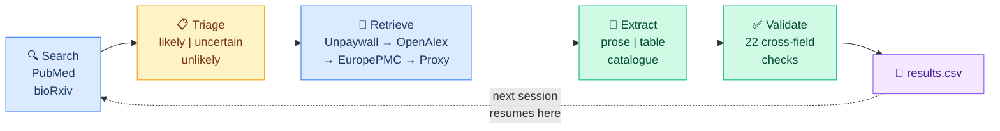

<p align="center">
  
</p>

<p align="center">
  <strong>An autonomous AI agent that builds trait databases from the scientific literature.</strong>
</p>

<p align="center">
  <a href="LICENSE"></a>
  <a href="https://doi.org/ZENODO_DOI_HERE"></a>
  <a href="https://claude.ai"></a>
  <a href="CITATION.cff"></a>
</p>

<p align="center">
  <a href="#quickstart">Quickstart</a> &bull;
  <a href="#how-it-works">How it works</a> &bull;
  <a href="#customize-for-your-system">Customize</a> &bull;
  <a href="#validation-study">Validation</a> &bull;
  <a href="#citation">Citation</a>
</p>

---

TraitTrawler is an autonomous literature-mining agent that runs inside [Claude Cowork](https://claude.ai). Point it at a taxon and a trait, and it will search PubMed and bioRxiv, retrieve full-text PDFs (including paywalled papers through your library proxy), extract structured data from prose, tables, and catalogues, and write validated records to a CSV. No API keys, no Python environment, no setup scripts.

This repository contains the agent code configured for **Coleoptera karyotype data**, plus a complete validation study comparing TraitTrawler's output against a human-curated database of 4,959 records.

## Quickstart

```bash
# 1. Clone this repo
git clone https://github.com/coleoguy/TraitTrawler.git

# 2. Open Cowork and select the TraitTrawler folder as your workspace

# 3. Install the skill plugin
#    Drag traittrawler.skill into Cowork (Settings → Plugins → Install)

# 4. Say "let's collect some data"
#    The agent picks up where it left off, or runs first-time setup on a fresh clone
```

**Requirements:** [Claude Cowork](https://claude.ai) Pro or Max subscription, Chrome extension, and your institution's library proxy URL.

## How it works



Each session the agent:

1. **Searches** unrun queries from `config.py` across PubMed and bioRxiv
2. **Triages** papers by relevance using rules in `collector_config.yaml` and domain knowledge from `guide.md`
3. **Retrieves** full text through a cascade: Unpaywall → OpenAlex → Europe PMC → Semantic Scholar → institutional proxy (using your browser session)
4. **Extracts** structured records, with a two-pass strategy for dense tables (enumerate species, then extract each row, then verify count)
5. **Validates** records against 22 cross-field consistency rules before writing
6. **Appends** to `results.csv` with atomic writes; updates `state/` so the next session resumes exactly where this one stopped

Stop anytime. Nothing is lost.

## Repository structure

```
TraitTrawler/
│
├── traittrawler.skill            # Install this in Cowork
├── collector_config.yaml         # Main configuration (taxa, traits, fields, proxy)
├── config.py                     # Search query list (1,286 queries for Coleoptera)
├── guide.md                      # Domain knowledge for extraction
├── context.md                    # Technical reference for Claude (do not edit)
│
├── skill/                        # Skill source code (do not edit)
│   └── references/
│       ├── csv_schema.md         # Output field definitions and types
│       ├── config_template.yaml  # Blank config template for new projects
│       └── extraction_examples.md
│
├── validation/                   # MEE manuscript validation study
│   ├── data/                     # Both datasets (human + AI)
│   ├── analysis/                 # R scripts (fully reproducible)
│   ├── results/                  # All analysis outputs
│   ├── manuscript/               # Manuscript, figures, supplements
│   └── README.md                 # Reproducibility instructions
│
├── CITATION.cff                  # Citation metadata (GitHub "Cite" button)
├── CONTRIBUTING.md               # How to contribute
├── LICENSE                       # MIT
└── README.md                     # This file
```

Auto-created on first run: `state/`, `pdfs/`, `results.csv`

## Customize for your system

TraitTrawler is taxon-agnostic. To collect data for a different organism and trait, edit three files:

<table>
<tr>
<th>File</th>
<th>What to change</th>
</tr>
<tr>
<td><code>collector_config.yaml</code></td>
<td>Project name, target taxa, trait definition, triage keywords, institutional proxy URL, output field schema</td>
</tr>
<tr>
<td><code>config.py</code></td>
<td>Search queries as a Python list — one query per entry</td>
</tr>
<tr>
<td><code>guide.md</code></td>
<td>Domain knowledge: notation conventions, taxonomic synonymies, extraction rules, example records</td>
</tr>
</table>

The core skill logic requires no modification.

<details>
<summary><strong>Example: adapting for avian body mass</strong></summary>

**collector_config.yaml**
```yaml
project_name: "Avian Body Mass Database"
target_taxa:
  - "Aves"
  - "birds"
  - "Passeriformes"
trait_name: "body mass"
trait_description: >
  Body mass (g) from wild-caught specimens. Include sex,
  sample size, and measurement method where reported.
triage_keywords:
  - body mass
  - body weight
  - morphometrics
proxy_url: "https://ezproxy.youruniversity.edu/login?url="
output_fields:
  - doi
  - species
  - family
  - body_mass_g
  - sex
  - sample_size
  - locality
```

**config.py**
```python
SEARCH_TERMS = [
    "Passeriformes body mass",
    "Columbiformes morphometrics",
    "bird body size scaling",
    # ...
]
```

**guide.md** — replace with field-specific guidance on measurement units, which body-mass values to prefer (breeding vs. non-breeding, male vs. female), and how to handle ranges reported as mean +/- SD.

</details>

<details>
<summary><strong>Institution proxy setup</strong></summary>

1. Set `proxy_url` in `collector_config.yaml` to your institution's EZProxy address
   - Texas A&M: `http://proxy.library.tamu.edu/login?url=`
   - Most universities: `https://ezproxy.youruniversity.edu/login?url=`
2. Log into your library proxy in Chrome before starting a session
3. The skill uses Chrome silently — you'll see `🌐 browser` when it fetches a paywalled paper

If not authenticated, the skill reports it once and falls back to open-access sources.

</details>

## Validation study

We validated TraitTrawler against a manually curated Coleoptera karyotype database (4,959 records, 4,298 species) assembled over two years. Full details, data, and reproducible analysis scripts are in [`validation/`](validation/).

| Metric | Value |
|:-------|------:|
| Records extracted | 5,339 (3,808 species) |
| Autonomous run time | ~15 hours over 3 days |
| Species overlap (Jaccard) | 0.50 (2,692 shared / 5,414 union) |
| HAC accuracy, raw (pre-2012) | 94.1% (n = 1,673; r = 0.955) |
| HAC accuracy, post-adjudication | 96.3% |
| Sex chromosome agreement | 92.7% (Cohen's kappa = 0.84) |
| Name spelling errors (GBIF) | AI 10.0% vs. Human 11.0% (p = 0.79) |
| New species contributed | 1,116 (+26%) |
| Approximate LLM cost | ~US $150 |

> **Key finding:** 28% of apparent disagreements between datasets were not errors but genuine intraspecific karyotypic variation documented in different primary sources. Combining independently curated datasets recovers biological variation that either dataset alone would miss.

The manuscript is in preparation for *Methods in Ecology and Evolution*:

> Blackmon, H. (2026). TraitTrawler: an autonomous AI agent for large-scale extraction of phenotypic data from the scientific literature. *Methods in Ecology and Evolution* (in prep).

## Output format

Records are written to `results.csv` with one row per species per paper. Fields are defined in `collector_config.yaml` → `output_fields`. The complete field reference with types, constraints, and confidence guidelines is in [`skill/references/csv_schema.md`](skill/references/csv_schema.md).

PDFs are saved to `pdfs/{family}/{FirstAuthor}_{Year}_{Journal}_{DOI}.pdf`.

## Citation

If you use TraitTrawler or the validation datasets, please cite:

```bibtex
@article{blackmon2026traittrawler,
  author  = {Blackmon, Heath},
  title   = {{TraitTrawler}: an autonomous {AI} agent for large-scale extraction
             of phenotypic data from the scientific literature},
  journal = {Methods in Ecology and Evolution},
  year    = {2026},
  note    = {In preparation}
}
```

GitHub's **"Cite this repository"** button (top right) provides formatted citations via [`CITATION.cff`](CITATION.cff).

## Contributing

See [`CONTRIBUTING.md`](CONTRIBUTING.md). Bug reports, new taxon configurations, and validation studies for other trait systems are welcome.

## License

[MIT](LICENSE). Use it, modify it, share it.
