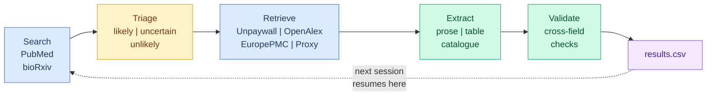

<p align="center">
  
</p>

<p align="center">
  <strong>An autonomous AI agent that builds trait databases from the scientific literature.</strong>
</p>

<p align="center">
  <a href="LICENSE"></a>
  <a href="https://doi.org/ZENODO_DOI_HERE"></a>
  <a href="https://claude.ai"></a>
  <a href="CITATION.cff"></a>
</p>

<p align="center">
  <a href="#quickstart">Quickstart</a> &bull;
  <a href="#how-it-works">How it works</a> &bull;
  <a href="#running-a-session">Running a session</a> &bull;
  <a href="#understanding-the-output">Output</a> &bull;
  <a href="#adapting-for-a-different-system">Adapt it</a> &bull;
  <a href="#validation-study">Validation</a> &bull;
  <a href="#citation">Citation</a>
</p>

---

TraitTrawler is an autonomous literature-mining agent that runs inside [Claude Cowork](https://claude.ai). Point it at a taxon and a trait, and it will search PubMed and bioRxiv, retrieve full-text PDFs (including paywalled papers through your library proxy), extract structured data from prose, tables, and catalogues, and write validated records to a CSV. No API keys, no Python environment, no setup scripts.

This repository is configured for **Coleoptera karyotype data** and includes a validation study comparing TraitTrawler's output against a human-curated database of 4,959 records. The agent is taxon-agnostic — adapting it for a different organism and trait requires editing three configuration files.

## Quickstart

**Prerequisites:** A [Claude](https://claude.ai) Pro or Max subscription with Cowork mode enabled, and the Claude in Chrome extension installed.

**Step 1 — Clone the repository**

```bash
git clone https://github.com/coleoguy/TraitTrawler.git
```

**Step 2 — Open Cowork and select the TraitTrawler folder**

In Claude Desktop, open Cowork mode. When prompted for a workspace folder, select the `TraitTrawler/` directory you just cloned. This gives the agent read/write access to the project files.

**Step 3 — Install the skill**

Open Cowork settings (gear icon) → Plugins → Install from file → select `traittrawler.skill` from the repository root. This registers the agent's behavior so Claude knows how to run the collection pipeline.

**Step 4 — Authenticate your library proxy**

Open Chrome and log into your institution's library portal. The agent uses your active browser session to access paywalled papers — it won't prompt you for credentials, but it needs an authenticated session. If you skip this step, the agent will still work but will be limited to open-access papers and abstracts.

**Step 5 — Start collecting**

In the Cowork chat, say something like:

> "let's collect some data"

or

> "run the agent"

The agent reads all configuration files, reports the current state of the database, and begins the search-triage-fetch-extract loop. It processes 5–10 papers per cycle and prints a progress update after each batch.

Stop anytime by telling the agent to stop or just closing the session. All state is saved after every paper — nothing is lost.

## How it works



Each session the agent:

1. **Searches** the next unrun queries from `config.py` across PubMed and bioRxiv.
2. **Triages** each paper as likely, uncertain, or unlikely using rules in `collector_config.yaml` and domain knowledge from `guide.md`. Unlikely papers are skipped; likely and uncertain papers proceed to fetch.
3. **Retrieves** full text through a cascade of sources: Unpaywall → OpenAlex → Europe PMC → Semantic Scholar → your institutional proxy (via Chrome). If none succeed, it falls back to the abstract and logs the paper in `leads.csv` so you can manually obtain the PDF later.
4. **Extracts** structured records. For table-heavy papers it runs a two-pass strategy: first enumerate every species, then extract each row, then verify the count matches. Catalogue entries (e.g., one-line-per-taxon reference books) are chunked and processed the same way.
5. **Validates** each record against cross-field consistency rules (e.g., `2 * haploid_autosome_count + sex_chr_count = 2n`) before writing.
6. **Appends** validated records to `results.csv` with atomic writes. Updates state files so the next session resumes exactly where this one stopped.

The agent handles scanned PDFs (image-only) by asking whether to use vision extraction. It also handles large PDFs (100+ pages) by processing them in 50-page batches across sessions.

## Running a session

### What to expect

When you start a session, the agent prints a status report:

```
════════════════════════════════════════════════
 Coleoptera Karyotype Database — Starting
════════════════════════════════════════════════
 Records in database : 1,247
 Papers processed    : 340
 Leads (need PDF)    : 18
 Queue depth         : 12 pending
 Queries run         : 89 / 1,669
 Next query          : "Chrysomelidae karyotype"
════════════════════════════════════════════════
```

It then enters the main loop and prints rolling updates as it works:

```
📄 [15/45 queued] "Smith et al. 2003 — Carabidae cytogenetics"
   → 8 records | source: proxy 🌐 | pdfs/Carabidae/Smith_2003_CompCytogen_9504.pdf
   → Session: +34 records | Database total: 1,281
```

At the end of a session (when you stop or searches are exhausted), you get a summary:

```
══════════════════════════════════════
 Session Complete
══════════════════════════════════════
 Papers processed this session : 23
 Records added                 : 89
 Via proxy (browser)           : 7
 Via open access               : 11
 Abstract-only                 : 5
 Leads added (need full text)  : 3
 Database total                : 1,336
 Leads total                   : 18
 Queue remaining               : 4
 Queries remaining             : 608 / 1,669
══════════════════════════════════════
```

### Session length

You control how long it runs. It can go for five minutes or five hours. Some practical patterns:

- **Background collection:** Start a session and let it run while you do other work. Check back when you want.
- **Targeted burst:** "Run through the Chrysomelidae queries" — point it at a specific subset.
- **Manual PDF follow-up:** After a few sessions, review `leads.csv` for high-priority papers the agent couldn't access. Drop PDFs into the `pdfs/` folder and run again — the agent detects local PDFs automatically.

### The dashboard

The agent generates a self-contained HTML dashboard at `dashboard.html` in the project root, updated at session start, every 10 papers, and session end. Open it in any browser. It shows record counts, taxonomic breakdowns, chromosome number distributions, collection progress, and the lead pipeline.

## Understanding the output

### results.csv

One row per species per paper. Core fields include DOI, species, family, chromosome number (2n), sex chromosome system, karyotype formula, staining method, collection locality, and extraction confidence. The complete field reference with types and validation rules is in `skill/references/csv_schema.md`.

Every record has an `extraction_confidence` score (0.0–1.0) and a `flag_for_review` boolean. Records with confidence below 0.75 are automatically flagged. The `notes` field explains why.

### leads.csv

Papers the agent identified as likely relevant but couldn't obtain full text for. Each row includes the DOI, title, why the fetch failed (e.g., `paywall_no_proxy_auth`, `pdf_download_failed`), whether abstract extraction was done, and how many records came from the abstract.

To resolve leads: find the PDF through your library or interlibrary loan, save it to `pdfs/{family}/`, and run another session. The agent checks for local PDFs before trying remote sources.

### pdfs/

Downloaded PDFs organized by family (or whatever grouping field you set in `collector_config.yaml`). Naming convention: `{FirstAuthor}_{Year}_{JournalAbbrev}_{ShortDOI}.pdf`.

### state/

Session state files that let the agent resume across sessions:

- `processed.json` — every paper the agent has handled (by DOI), with outcome and record count.
- `queue.json` — papers fetched from search but not yet extracted.
- `search_log.json` — which search queries have been run.
- `large_pdf_progress.json` — bookmarks for multi-session processing of large PDFs.

You should never need to edit these. If something goes wrong, the agent will warn you about malformed JSON rather than silently overwriting.

## Repository structure

```
TraitTrawler/
│
├── traittrawler.skill            # Install this in Cowork
├── collector_config.yaml         # Main configuration (taxa, traits, fields, proxy)
├── config.py                     # Search query list (1,669 queries for Coleoptera)
├── guide.md                      # Domain knowledge for extraction
│
├── skill/                        # Skill source code
│   ├── SKILL.md                  # Agent behavior specification
│   ├── dashboard_generator.py    # Generates dashboard.html
│   └── references/
│       ├── csv_schema.md         # Output field definitions and types
│       ├── config_template.yaml  # Blank config template for new projects
│       └── extraction_examples.md  # Notation guide for catalogues and tables
│
├── validation/                   # MEE manuscript validation study
│   ├── data/                     # Both datasets (human + AI)
│   ├── analysis/                 # R scripts (fully reproducible)
│   ├── results/                  # All analysis outputs
│   ├── manuscript/               # Manuscript, figures, supplements
│   └── README.md                 # Reproducibility instructions
│
├── CITATION.cff                  # Citation metadata (GitHub "Cite" button)
├── CONTRIBUTING.md               # How to contribute
├── LICENSE                       # MIT
└── README.md                     # This file
```

Auto-created on first run: `state/`, `pdfs/`, `results.csv`, `leads.csv`, `dashboard.html`

## Adapting for a different system

TraitTrawler is taxon-agnostic. To collect data for a different organism and trait, you edit three files. The skill logic requires no modification.

### The three configuration files

**`collector_config.yaml`** is the master configuration. It defines what the agent is looking for (target taxa, trait name, triage keywords), how it accesses papers (proxy URL), and what fields appear in the output CSV. When you change the trait, you also change `output_fields` to match. The file includes a commented example showing how to reconfigure for avian body mass.

**`config.py`** contains the search query list as a Python list called `INITIAL_SEARCH_TERMS`. The Coleoptera version uses a cross-product of 148 family names and 11 cytogenetics keywords (1,628 family-specific queries) plus general and journal-targeted terms (1,669 total). For a new system, replace the family lists and keywords with terms appropriate to your taxon and trait. The cross-product helper function `_family_terms()` is reusable.

**`guide.md`** is the domain knowledge document. The agent reads it at startup and uses it for every triage and extraction decision. For Coleoptera karyotypes it covers notation conventions (how to read `11+Xyp`), sex chromosome system diversity, family-specific rules, validation checks, taxon name synonymies, and staining method standardization. For a different system, replace the content with equivalent domain knowledge for your trait. Be specific and concrete — include worked examples. The more precise the rules, the better the extractions.

### Step-by-step: adapting for a new system

1. **Fork or clone the repository.**

2. **Edit `collector_config.yaml`:**
   - Change `project_name`, `target_taxa`, `trait_name`, `trait_description`.
   - Replace `triage_keywords` with terms that signal relevance for your trait.
   - Update `triage_rules` — write plain-language descriptions of what makes a paper likely, uncertain, or unlikely for your specific data type.
   - Set your `proxy_url` and `institution`.
   - Replace `output_fields` with the fields your trait needs. Keep the core metadata fields (doi, paper_title, species, etc.) and the quality fields (extraction_confidence, flag_for_review, etc.). Replace the karyotype-specific fields (chromosome_number_2n, sex_chr_system, etc.) with your trait fields.

3. **Rewrite `config.py`:**
   - Define your taxon list (families, genera, or whatever grouping makes sense).
   - Define your trait keywords.
   - Build `INITIAL_SEARCH_TERMS` from the cross-product plus any general and journal-targeted terms.

4. **Rewrite `guide.md`:**
   - Define what makes a record valid (minimum required fields).
   - Define flag-for-review conditions.
   - Document notation conventions for your trait (how is the data typically reported in papers?).
   - Add taxon-specific notes and common pitfalls.
   - Include worked extraction examples.

5. **Delete `state/`, `results.csv`, `leads.csv`, and `pdfs/`** (if they exist from a previous project). The agent creates fresh versions on first run.

6. **Run the setup wizard** by starting a session. If no `collector_config.yaml` exists (or if you deleted state files), the agent walks you through setup interactively.

### Example: avian body mass

<details>
<summary>Click to expand</summary>

**collector_config.yaml** (key sections)
```yaml
project_name: "Avian Body Mass Database"
target_taxa:
  - "Aves"
  - "birds"
  - "Passeriformes"
trait_name: "body mass"
trait_description: >
  Body mass (g) from wild-caught specimens. Include sex,
  sample size, and measurement method where reported.
triage_keywords:
  - body mass
  - body weight
  - morphometrics
proxy_url: "https://ezproxy.youruniversity.edu/login?url="
output_fields:
  - doi
  - paper_title
  - first_author
  - paper_year
  - species
  - family
  - order
  - body_mass_g
  - sex
  - sample_size
  - measurement_method
  - locality
  - extraction_confidence
  - flag_for_review
  - source_type
  - notes
  - processed_date
```

**config.py**
```python
_ORDERS = ["Passeriformes", "Accipitriformes", "Strigiformes", ...]
_KEYWORDS = ["body mass", "body weight", "morphometrics", "body size"]

INITIAL_SEARCH_TERMS = (
    ["avian body mass", "bird body weight survey", ...]
    + [f"{order} {kw}" for order in _ORDERS for kw in _KEYWORDS]
)
```

**guide.md** — Replace entirely with guidance on: preferred mass units (always grams), how to handle male/female/unsexed, breeding vs. non-breeding mass, ranges reported as mean +/- SD (record mean), captive specimens (exclude or flag), and juvenile vs. adult.

</details>

### Institution proxy setup

<details>
<summary>Click to expand</summary>

1. Set `proxy_url` in `collector_config.yaml` to your institution's EZProxy address:
   - Texas A&M: `http://proxy.library.tamu.edu/login?url=`
   - Most universities: `https://ezproxy.youruniversity.edu/login?url=`
2. Log into your library proxy in Chrome before starting a session.
3. The skill uses Chrome silently — you'll see `🌐 browser` in the progress updates when it fetches a paywalled paper through the proxy.

If you're not authenticated, the agent reports it once and falls back to open-access sources and abstracts for the rest of the session. Papers it couldn't get are logged in `leads.csv`.

</details>

## Validation study

We validated TraitTrawler against a manually curated Coleoptera karyotype database (4,959 records, 4,298 species) assembled over two years. Full details, data, and reproducible analysis scripts are in [`validation/`](validation/).

| Metric | Value |
|:-------|------:|
| Records extracted | 5,339 (3,808 species) |
| Autonomous run time | ~15 hours over 3 days |
| Species overlap (Jaccard) | 0.50 (2,692 shared / 5,414 union) |
| HAC accuracy, raw (pre-2012) | 94.1% (n = 1,673; r = 0.955) |
| HAC accuracy, post-adjudication | 96.3% |
| Sex chromosome agreement | 92.7% (Cohen's kappa = 0.84) |
| Name spelling errors (GBIF) | AI 10.0% vs. Human 11.0% (p = 0.79) |
| New species contributed | 1,116 (+26%) |
| Approximate LLM cost | ~US $150 |

> **Key finding:** 28% of apparent disagreements between datasets were not errors but genuine intraspecific karyotypic variation documented in different primary sources. Combining independently curated datasets recovers biological variation that either dataset alone would miss.

The manuscript is in preparation for *Methods in Ecology and Evolution*:

> Blackmon, H. (2026). TraitTrawler: an autonomous AI agent for large-scale extraction of phenotypic data from the scientific literature. *Methods in Ecology and Evolution* (in prep).

## Citation

If you use TraitTrawler or the validation datasets, please cite:

```bibtex
@article{blackmon2026traittrawler,
  author  = {Blackmon, Heath},
  title   = {{TraitTrawler}: an autonomous {AI} agent for large-scale extraction
             of phenotypic data from the scientific literature},
  journal = {Methods in Ecology and Evolution},
  year    = {2026},
  note    = {In preparation}
}
```

GitHub's **"Cite this repository"** button (top right) provides formatted citations via [`CITATION.cff`](CITATION.cff).

## Contributing

See [`CONTRIBUTING.md`](CONTRIBUTING.md). Bug reports, new taxon configurations, and validation studies for other trait systems are welcome.

## License

[MIT](LICENSE). Use it, modify it, share it.
